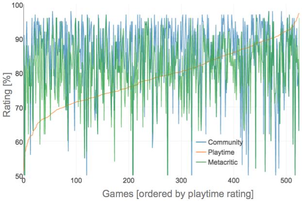
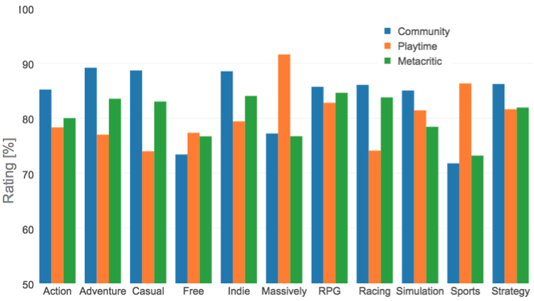
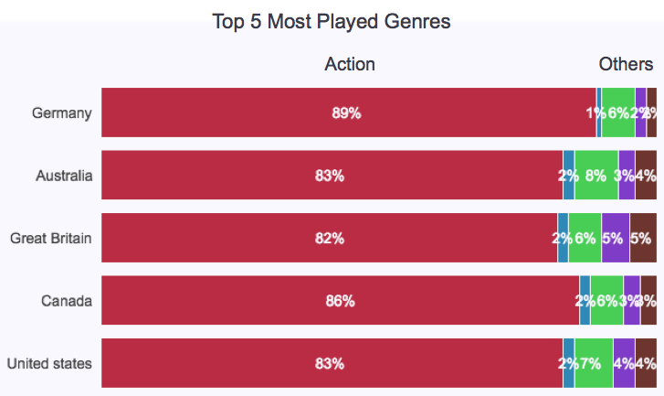

# Steam User Recommender

The initial idea for this project stemmed from trying online dating for the first time and learning a little about how it works during my time at [Galvanize](http://www.galvanize.com/). Rather than ask users questions they could answer with varying degrees of fervor, this system would simply use the games users have already played and how much they have played them to create an explicit rating system to match similar users. The rough idea is that such a system could help people make new friends based on common gaming interests.
## Data Collection  

  
 [I] General workflow image   

* Python class to collect 17-digit user IDs from my friends,  
then their friends, and so on, using the Steam GetFriendList API  
* Python class to collect for each user:
  * APIs
    * GetFriendList:
      * friend IDs
      * friendship length [epoch time]
    * GetOwnedGames:
      * appid & name
      * playtime_forever [min]
      * playtime_2weeks [min]
    * GetPlayerBans:
      * CommunityBanned (bool) - banned from Steam Community
      * VACBanned (bool) - Banned for cheating online
      * NumberOfVACBans (int) Number of VAC bans on record
      * DaysSinceLastBan (int) - Number of days since the last ban
      * NumberOfGameBans (int) - Number of bans in games
      * EconomyBan (string) - none, banned, probation
    * GetPlayerSummaries (at minimum):
      * avatarfull - url of 184 x 184 profile image
      * personastate - 0, 1, 2, 3, 4, 5, or 6
      * communityvisibilitystate - 1 is private, 3 is public
      * personaname - player display name
      * many others, including locations, if posted by the user
  * Web Scraping
    * Profile (generally very sparse)
      * Text summary
      * Player level
      * Number of friends, badges, screenshots
    * Game Information
      * Price
      * Community rating
      * Release year
      * Genre
* Inserted consolidated dictionary for each user into a Mongo  
  database

### Data Cleaning (via EC2)
* Python class to import data to Pandas (slow)
  * Remove unnecessary columns
  * Unpack columns with dictionaries
  * Deal with lists of dictionaries
* Converted to SFrames to use GraphLab

### Some Fun Numbers
* 150,000 unique gamers, 8,000 unique games between them all
* Reduced to 526 games after filtering by games with above  
average playtime (summed over all 150k gamers)
* Reducing from 8,000 games to 526 games only reduced  
total playtime from 345 million to 315 million hours.
* One user had played Skyrim for 4,500 hours!

## Recommender
To really capture user preferences based on playtime,  
more work needs to be done to to differentiate genres as well  
*what* genres to choose for each game. The store page has  
community-chosen genre tags, which I would like to implement  
in my next model. For now, below is a summary of its current form.
* Dato GraphLab Factorization Recommender
  * Items: 526 most popular games, considering:
    * Game age
    * Game price (current)
    * Game genre (store-given top genre)
    * Game community rating (0 - 8)
  * Users: 150,000 Steam users, considering:
    * Number of games owned
    * Number of friends
    * Location (sparse; considering modeling by country)
    * Ban status
    * Average playtime (maybe)
    * Profile age
    * Average weekly playtime (maybe)
  * Rating: Scaled playtime in minutes to explicit 0-5 rating
    * 0: 0min
    * 1: 1min - 60min
    * 2: 61min - 180min
    * 3: 181min - 420min
    * 4: 421min - 900min
    * 5: Over 901min

To get an idea of how my explicit playtime to rating compared to some actual ratings, I collected meta critic and community ratings for each game. I then ordered by my rating to get a rough idea of what this looks like.  

  
 [II] Playtime rating is the clean curve. Looks like it does not match up too well...  
To get a better idea of where some issues might be, I grouped games by genre (the genre tag they are posted in the store under) and averaged the reviews.  

  
 [III] Comparing the community, playtime, and Metacritic ratings by genre for the top 526 games  
It looks like games where you tend to play a lot (e.g., massively multiplayer, strategy, RPGs) generally have more favorable playtime ratings (surprise!). Casual games or Indie games might be games where the emphasis is upon the artwork or music and do not require tens of hours to complete while still being great games ([e.g., Braid, one of my favorites](http://store.steampowered.com/app/26800/)). So rather than look at each game individually and create a custom playtime to explicit rating, maybe I could use the genres to help me out.  
  
 [IV] The top 5 countries in my dataset and the top 5 most played genres  
What jumps out with this image is that Action is probably way too generalized. With a little exploring, [Lovers in a Dangerous Spacetime](http://store.steampowered.com/app/252110/) and [Counter-Strike: Global Offensive](http://store.steampowered.com/app/730/) are both posted in the store under Action. A quick look at the store pages will tell you that these games are incredibly different. This leads into my future work section.

## Limitations
* Including total 8,000 games resulted in 14.2 million user-game pairs
  * Summed up total playtimes by each user for each game, took  
  the average, and included only games with playtimes above  
  that, reducing the number from 8,000 to 526, while only   
  reducing the user-game pairs to 7.09 million. Since I am  
  trying to connect users (rather than recommend games),  
  this felt appropriate.
* Very sparse profile summaries and information
* Current model only works for the 150k people already collected.  
* Current genres pulled from the store are pretty vague and  
too general. See below:  

* I would like to use the community-chosen tags to created  
better defined genres, factoring the order of the tags.  
Currently, games like CS:GO and BattleBlock Theater are under  
"Action."

## Further Ideas
* Tracking game genres over time
* Favorite genres by country
* Average user playtime by location
* Average profile length by location
* The current app works with people already in the model, which is very  
limited. However, it demonstrates how an idea like this could / would work:  
copy your profile URL, and get links to similar players.

## Explicit Ratings
I wanted to really emphasize
